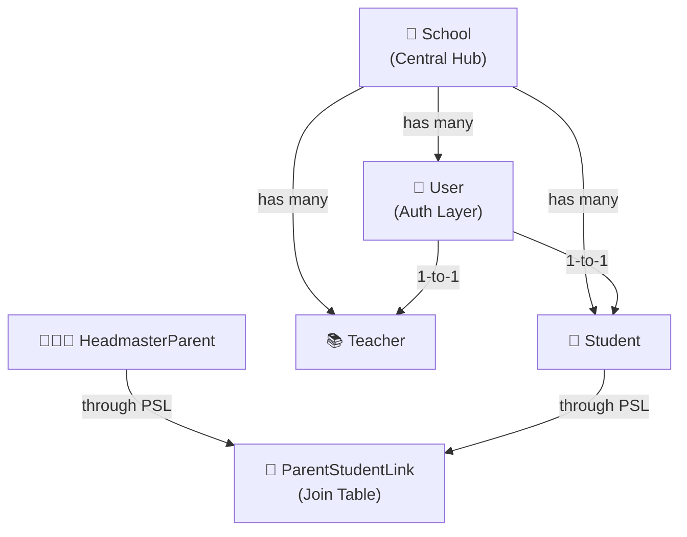
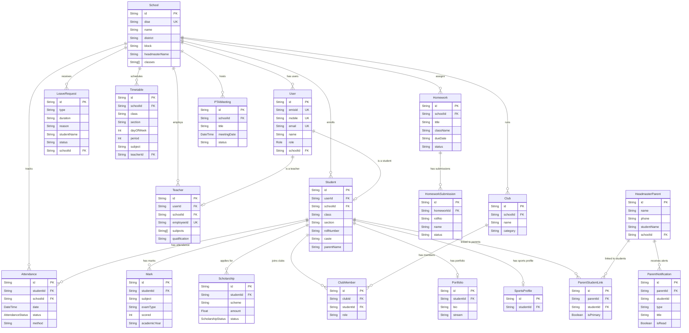
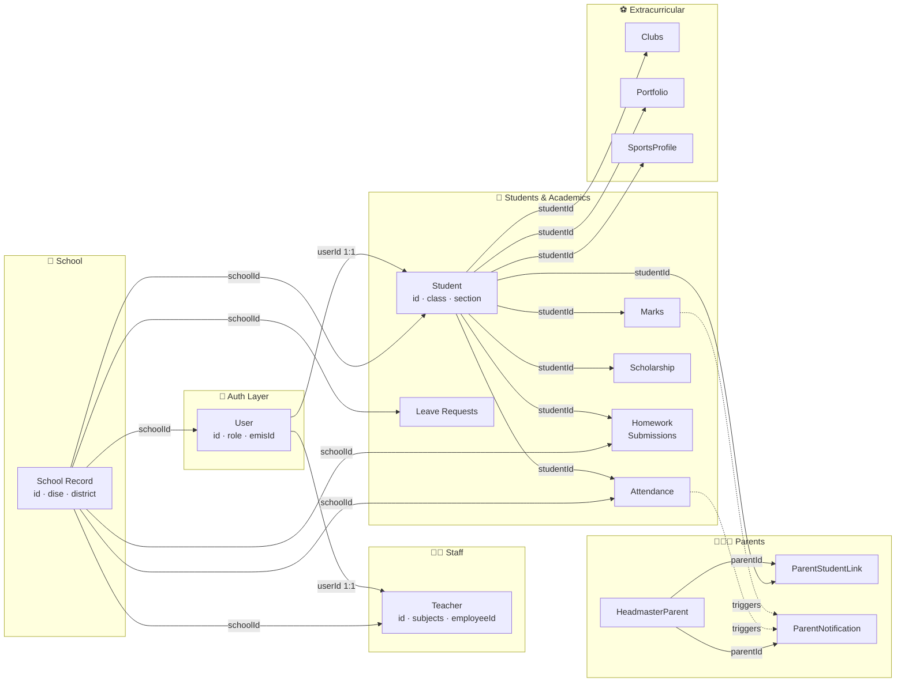

# 🏫 TN-Schools — Database Structure Overview

## 1. High-Level Entity Map



---

## 2. Full Entity-Relationship Diagram



---

## 3. Core Entity Relationships — Explained

### 🏫 School → The Central Hub
Every major entity links back to `School` via `schoolId`.  
This means **all data is school-scoped** — a teacher, student, attendance record, timetable, leave request, etc. all belong to exactly one school.

| Relationship | Field | Type |
|---|---|---|
| School → Users | `User.schoolId` | FK → `School.id` |
| School → Students | `Student.schoolId` | FK → `School.id` |
| School → Teachers | `Teacher.schoolId` | FK → `School.id` |
| School → Timetables | `Timetable.schoolId` | FK → `School.id` |
| School → Attendance | `Attendance.schoolId` | FK → `School.id` |
| School → Leave Requests | `LeaveRequest.schoolId` | FK → `School.id` |

---

### 👤 User → The Authentication Layer
`User` is the **login/auth identity**. A User can be a Student, Teacher, Parent, Headmaster, BEO, DEO, etc. (via `role` enum).

```
User (role=STUDENT) ──1:1──► Student profile
User (role=TEACHER) ──1:1──► Teacher profile
User (role=HEADMASTER) → no linked profile table yet
```

| Field | Description |
|---|---|
| `User.id` | Primary key, UUID |
| `User.emisId` | EMIS Student ID (for students) |
| `User.role` | Determines what the user can access |
| `User.schoolId` | Which school this user belongs to |

---

### 🎒 Student → The Academic Core
The `Student` record holds all academic info. It is linked 1:1 to a `User` for login.

```
User ──1:1──► Student ──1:N──► Attendance
                         ──1:N──► Marks
                         ──1:N──► Scholarships
                         ──1:N──► ClubMemberships
                         ──1:1──► Portfolio
                         ──1:1──► SportsProfile
                         ──1:N──► ParentStudentLink
```

| FK | Points to | Purpose |
|---|---|---|
| `Student.userId` | `User.id` | Login identity |
| `Student.schoolId` | `School.id` | School enrollment |

---

### 📚 Teacher → Staff Record
`Teacher` is linked 1:1 to a `User` for authentication.

```
User ──1:1──► Teacher ──(teacherId referenced in)──► Timetable
```

| FK | Points to | Purpose |
|---|---|---|
| `Teacher.userId` | `User.id` | Login identity |
| `Teacher.schoolId` | `School.id` | Employment school |

> ⚠️ Note: `Timetable.teacherId` stores the teacher reference but is not enforced via a Prisma relation (no `@relation` decorator). It is a loose string FK currently.

---

### 👨‍👩‍👧 Parent → The HeadmasterParent Model

Parents are stored in `HeadmasterParent` (not linked to `User` for auth yet).  
The connection between **Parent ↔ Student** is via the **join table** `ParentStudentLink`.

```
HeadmasterParent ──1:N──► ParentStudentLink ◄──N:1── Student
                  ──1:N──► ParentNotification
```

| Field | Description |
|---|---|
| `ParentStudentLink.parentId` | FK → `HeadmasterParent.id` |
| `ParentStudentLink.studentId` | FK → `Student.id` |
| `ParentStudentLink.isPrimary` | Marks the primary child |

This **many-to-many** design supports one parent with multiple children and one child with multiple parents.

---

### 📋 Notifications Flow

```
Attendance updated ──triggers──► ParentNotification
Mark updated       ──triggers──► ParentNotification
Homework assigned  ──triggers──► ParentNotification
PTA Meeting created──triggers──► ParentNotification
```

`ParentNotification` always targets a specific `parentId` and optionally a `studentId` to identify which child it is about.

---

## 4. Data Flow Diagram



---

## 5. Primary & Foreign Key Map

| Table | Primary Key | Foreign Keys |
|---|---|---|
| `School` | `id` | — |
| `User` | `id` | `schoolId → School.id` |
| `Student` | `id` | `userId → User.id`, `schoolId → School.id` |
| `Teacher` | `id` | `userId → User.id`, `schoolId → School.id` |
| `Attendance` | `id` | `studentId → Student.id`, `schoolId → School.id` |
| `Mark` | `id` | `studentId → Student.id` |
| `Scholarship` | `id` | `studentId → Student.id` |
| `Timetable` | `id` | `schoolId → School.id` |
| `Homework` | `id` | `schoolId → School.id` |
| `HomeworkSubmission` | `id` | `homeworkId → Homework.id` |
| `LeaveRequest` | `id` | `schoolId → School.id` |
| `HeadmasterParent` | `id` | `schoolId → School.id` (loose) |
| `ParentStudentLink` | `id` | `parentId → HeadmasterParent.id`, `studentId → Student.id` |
| `ParentNotification` | `id` | `parentId → HeadmasterParent.id` |
| `PTAMeeting` | `id` | `schoolId → School.id` (loose) |
| `Club` | `id` | `schoolId → School.id` (loose) |
| `ClubMember` | `id` | `clubId → Club.id`, `studentId → Student.id` |
| `Portfolio` | `id` | `studentId → Student.id` |
| `SportsProfile` | `id` | `studentId → Student.id` |

> **"loose"** = `schoolId` is stored as a plain `String?` without a Prisma `@relation` directive, so Prisma won't enforce referential integrity on these.

---

## 6. What Can Be Accessed Through Each Relationship

| Starting From | You Can Access |
|---|---|
| **School** | All users, students, teachers, attendance records, timetables, leave requests, homework, PTA meetings |
| **User** | Their student profile OR teacher profile (via 1:1 relation) |
| **Student** | Their school, their user/login, all attendance, all marks, all scholarships, club memberships, portfolio, sports profile, parent links |
| **Teacher** | Their school, their user/login |
| **HeadmasterParent** | All linked students (via ParentStudentLink), all their notifications |
| **ParentStudentLink** | The parent record + the student record (bridging both sides) |
| **ParentNotification** | The parent it targets |
| **Attendance** | The student + the school |
| **Mark** | The student |
| **Scholarship** | The student |
| **Homework** | The school + all its submissions |
| **HomeworkSubmission** | Its homework |
| **Club** | All its members (students) and events |
| **ClubMember** | The club + the student |
| **Portfolio** | The student + skills, projects, achievements |
| **SportsProfile** | The student + teams, fitness stats, events, health logs |

---

## 7. ⚠️ Current Structural Gaps / Proposed Improvements

| Issue | Current State | Suggested Improvement |
|---|---|---|
| **Parent Auth** | `HeadmasterParent` has no `userId` link | Add `userId FK → User.id` so parents can log in |
| **Timetable.teacherId** | Plain `String?`, no Prisma relation | Add `@relation` to `Teacher` model |
| **LeaveRequest** | No `studentId` FK | Add `studentId FK → Student.id` for direct student linkage |
| **Headmaster profile** | No dedicated model; uses `User.role=HEADMASTER` | Add `Headmaster` model for profile data |
| **schoolId loose FKs** | Several models use `String? schoolId` without `@relation` | Enforce with Prisma `@relation` for data integrity |
